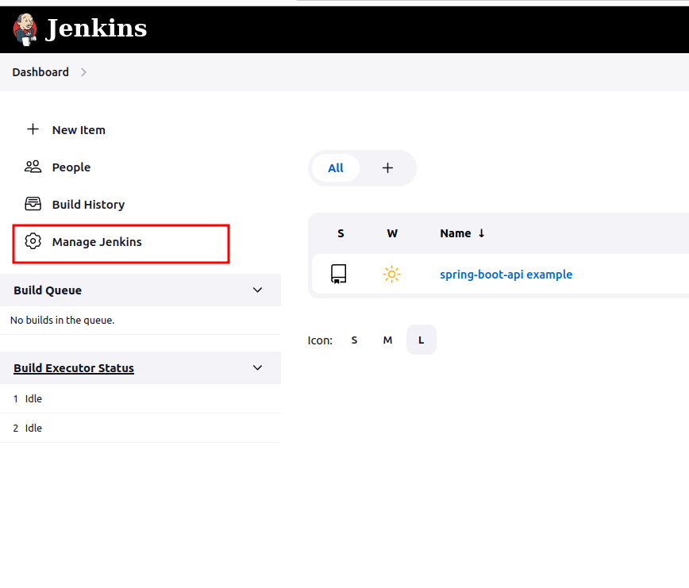
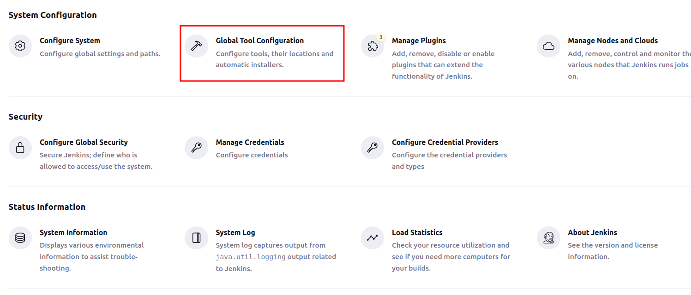
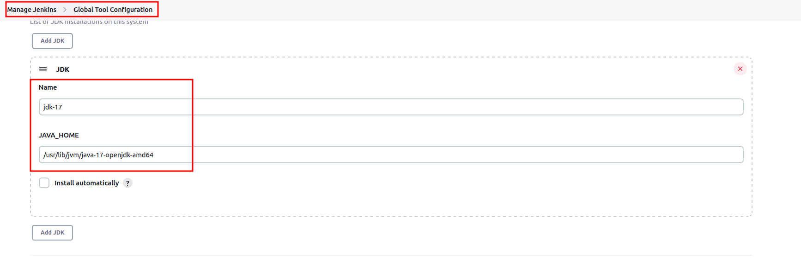
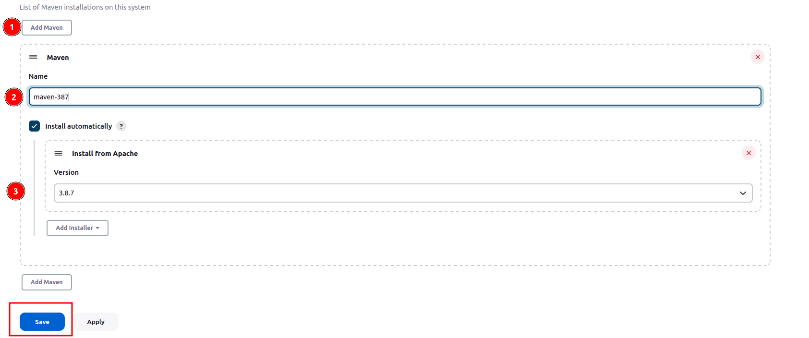
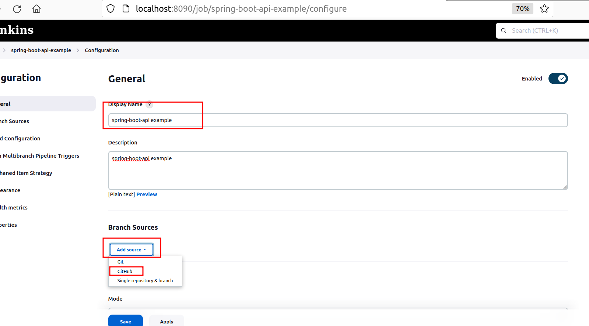
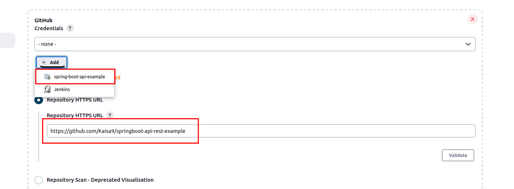
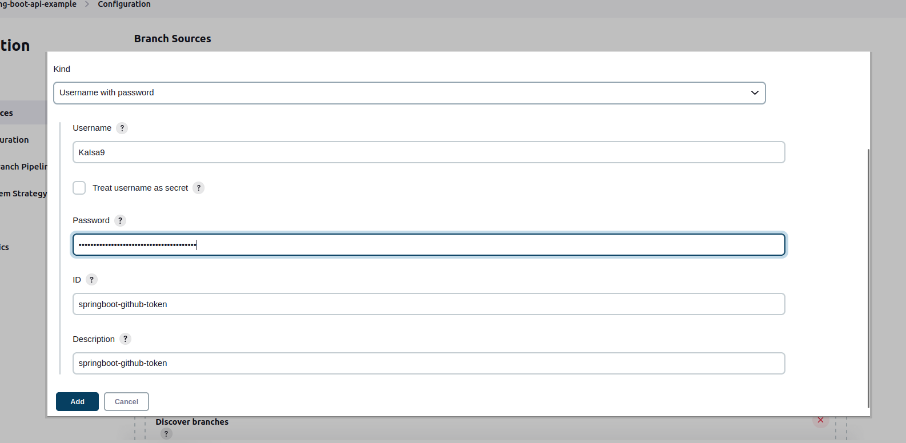
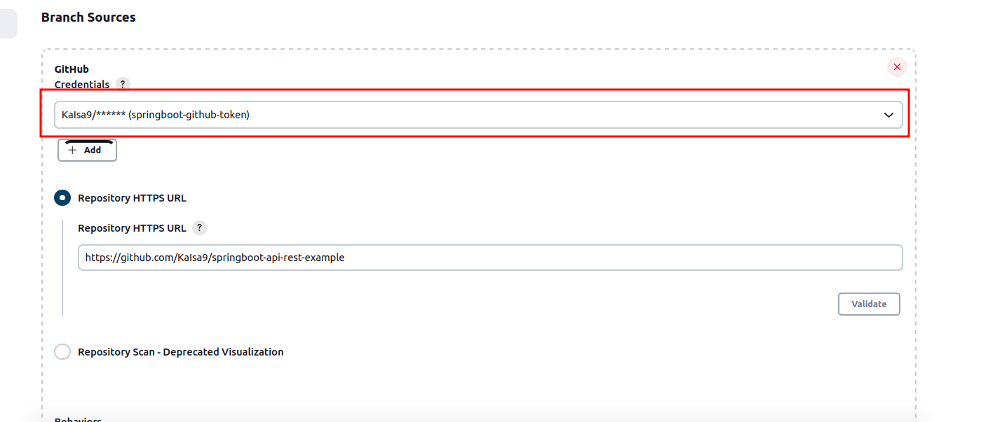
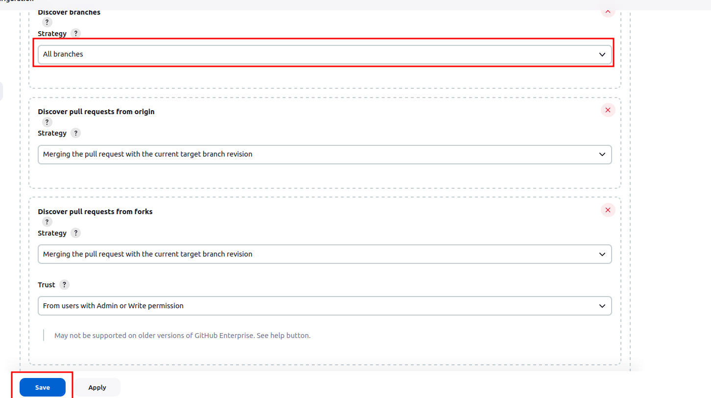

# Alliedium DevOps course 2022
##Jenkins part 1
Prerequisites.
1. Ubuntu linux
2. Ansible
3. JDK-17 -?

## Install Jenkins with package manager Linux (Manjaro)
1. [Instructions](https://www.geeksforgeeks.org/installing-and-configuring-jenkins-on-arch-based-linux-distributions-manjaro/)
   update and upgrade your system
    ''' sudo pacman -Syu'''
    install Java runtime environment
    ''' sudo pacman -S jdk17-openjdk'''
    set the default JRE version
    '''sudo archlinux-java set java-17-openjdk/jre'''
    '''sudo pacman -S jenkins'''
    '''sudo systemctl start jenkins'''
    '''sudo systemctl status jenkins'''
    '''sudo systemctl status jenkins'''
2. Navigate to http://localhost:8090. Find the default password in '''sudo cat /var/lib/jenkins/secrets/initialAdminPassword'''
3. Create admin user
4. Install suggested plugins
5. Additionally install Warning Next Generation plugin and HTML publisher (Navigate to Manage Jenkins -> Manage Plugins)
 
## Install Jenkins with ansible-playbook on Linux ubuntu
1. Clone project ansible-jenkins from '''git clone https://github.com/KaIsa9/ansible-jenkins.git'''
2. Initiate submodules with ansible roles: 'git submodule init'
3. Run ansible playbook ansible ansible-playbook playbooks/install0jenkins-plugins.yml -i ./inventory
4. Check that Jenkins is available al http://localhost:8090/ Your credentials are admin/admin 

## Add project to the Jenkins
Add jdk and maven to Jenkins 
1. Navigate to Manage Jenkins -> Global Tool Configuration

2. Press 'Add JDK', indicate installation name and path to the JDK on your machine. (For our project we installed (jdk-17 with ansible script) 
3. Scroll down the page and press 'Add maven'. Give name 'maven-387', check the box 'install automatically' and choose the version from the drop-down list 'maven 3.8.7'

5. Create new item 
6. Set the branch configuration as follows. Populate Displayed name and select as a code source Github 

7. Add to the 'Repositopry HTTP URL': 'https://github.com/KaIsa9/springboot-api-rest-example' and add credentials:

8. Use personal token as a password -???
9. 
10. Discover strategy: Select 'All branches' from the drop-down

## Install postgreSQL-13

1. Download archive postgresql-13.0.tar.gz from https://www.postgresql.org/ftp/source/v13.0/
2. Extract it
3. Open directory with installation files and follow the instructions from file INSTALL
   '''cat INSTALL
   ./configure
   make
   su - Ubuntu doesn't have root user, use 'sudo -i' (https://askubuntu.com/questions/825862/why-doesnt-the-su-command-work-in-ubuntu-but-does-in-other-linux-distros)
   make install
   adduser postgres
   mkdir /usr/local/pgsql/data
   chown postgres /usr/local/pgsql/data
   su - postgres
   /usr/local/pgsql/bin/initdb -D /usr/local/pgsql/data
   /usr/local/pgsql/bin/pg_ctl -D /usr/local/pgsql/data -l logfile start
   /usr/local/pgsql/bin/createdb test -- You can use this command like here, or create database with name
   /usr/local/pgsql/bin/psql test
   '''